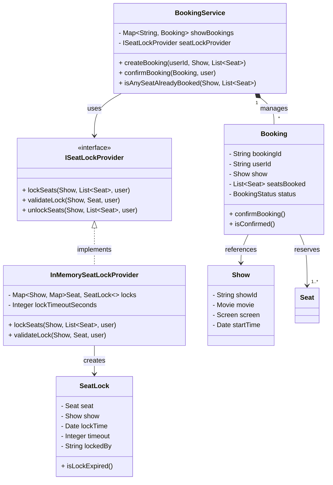
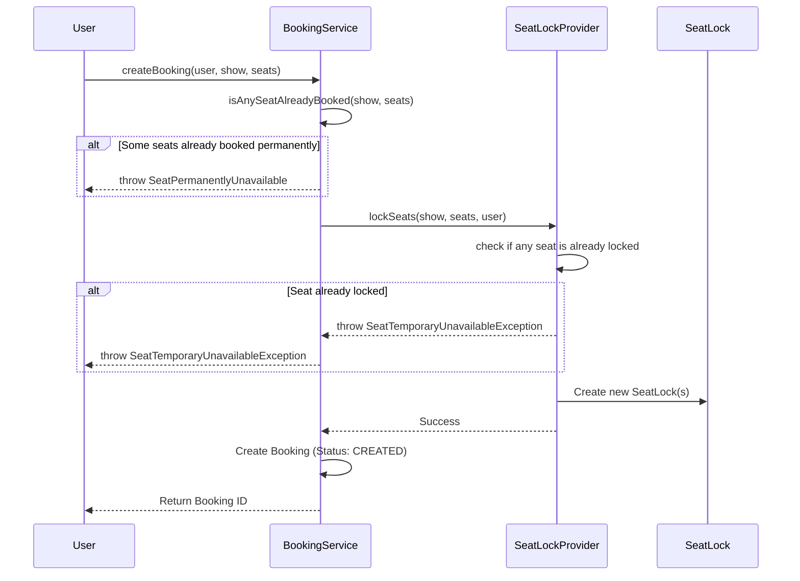
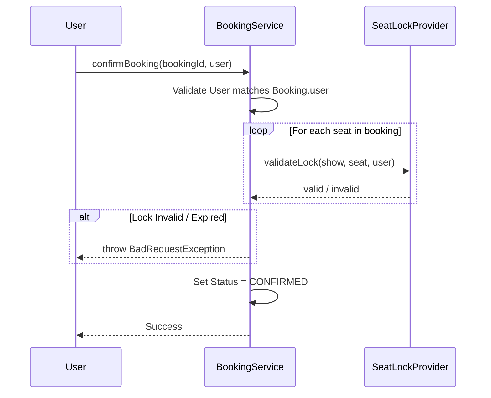

# 🏗️ Architecture Design Document

## 1. Overview
The Movie Ticket Booking System is designed to handle the core complex logic of booking movie tickets, focusing on data consistency, concurrency handling (seat locking), and modularity. The system follows a Low-Level Design (LLD) approach suitable for interviews and system design studies.

## 2. High-Level Architecture
The application is structured in layers to separate concerns:

```
[API Layer] -> [Service Layer] -> [Provider/Data Layer]
     |               |                   |
(Entry Point)   (Business Logic)    (Storage & Locking)
```

## 3. Class Diagram

The following class diagram illustrates the key entities and their relationships within the system.



### 3.1 Component Breakdown

#### **User Interface / API Layer**
- **`BookingController`**: (In Progress) Intended to be the REST API or input handling layer that takes user requests and delegates to services.
- **`App`**: The main entry point to run the application (currently a simple executable).

#### **Service Layer**
This layer contains the core business rules.
- **`BookingService`**: The heart of the system.
    - Manages the lifecycle of a `Booking`.
    - Coordinates with `ISeatLockProvider` to ensure seats are locked before booking.
    - Validates booking confirmation (checks user match, lock validity).
- **`ShowService`**: Manages movie shows.
- **`MovieService`**: Manages movie metadata.
- **`SeatAvailabilityService`**: Checks which seats are free or locked for a specific show.
- **`PaymentService`**: Interfaces with payment gateways (currently a simulation).

#### **Provider Layer**
- **`ISeatLockProvider`**: utilization of the **Strategy Pattern** to plug in different locking mechanisms (e.g., In-Memory, Redis).
- **`InMemorySeatLockProvider`**: A thread-safe, in-memory implementation of seat locking using `synchronized` blocks and HashMaps.
    - Handles `lockSeats`, `unlockSeats`, and `validateLock`.
    - Implements Time-To-Live (TTL) logic for locks (though currently, `isLockExpired` logic resides in `SeatLock`).

#### **Data / Model Layer**
Represents the physical and logical entities.
- **`Theatre`** 1--* **`Screen`** 1--* **`Seat`**
- **`Show`**: Represents a specific movie playing on a screen at a time.
- **`Booking`**: Links a `User`, `Show`, and a list of `Seat`s.
- **`SeatLock`**: Represents a temporary hold on a seat.

---

## 4. Key Workflows

### 4.1 Booking Creation Flow (Sequence Diagram)




### 4.2 Booking Confirmation Flow
1. **User** completes payment (simulated).
2. **`BookingService`** calls `confirmBooking`.
3. Validates that the user confirming is the one who created the booking.
4. **`SeatLockProvider`** validates that the locks:
    - Still exist.
    - Belong to this user.
    - Have not expired.
5. If valid, the `Booking` status is updated to `CONFIRMED`.
6. (Optional) Locks might be released or converted to permanent bookings (depending on specific implementation details).



---

## 5. Concurrency Model
Handling multiple users trying to book the same seat is the most critical part of this system.

- **Optimistic vs Pessimistic**: The system creates a temporary "Lock" (Pessimistic Short-term) during the booking process.
- **Synchronization**: `InMemorySeatLockProvider` uses `synchronized` methods to ensure that `lockSeats` is atomic. Two threads cannot lock the same seat simultaneously.
- **TTL (Time To Live)**: `SeatLock` has a creation timestamp and a timeout. If a user doesn't confirm within the timeout, the lock is considered invalid, allowing others to book.

## 6. Directory Structure Mapping
- `src/api`: Controllers/Entry points.
- `src/model`: POJOs (Entities).
- `src/service`: Business logic.
- `src/provider`: Interfaces and implementations for external dependencies (Locking, Database).
- `src/exceptions`: Custom error handling.

## 7. Future Improvements
- **Database Integration**: Replace in-memory Maps with a real DB (Postgres/MySQL).
- **Distributed Locking**: Replace `InMemorySeatLockProvider` with Redis for distributed systems.
- **API Completion**: Fully implement `BookingController`.
